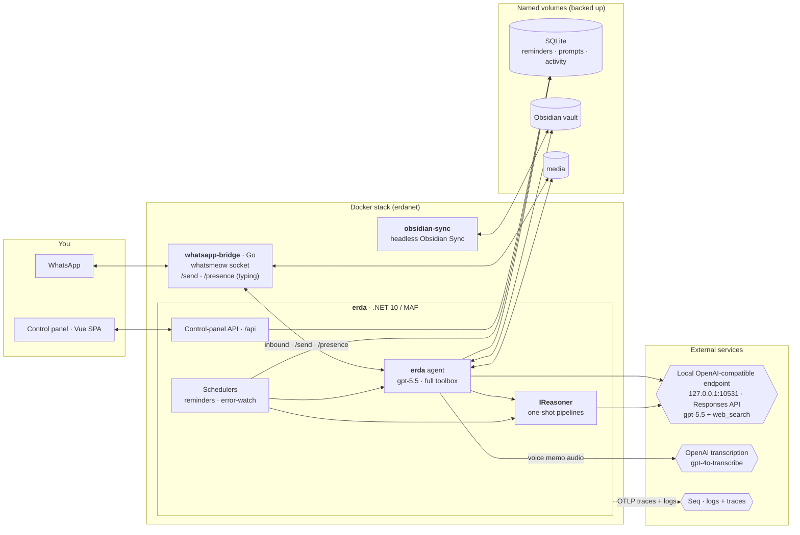
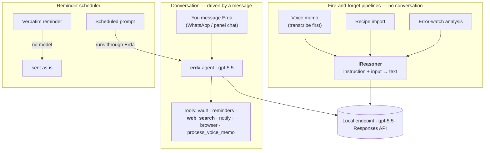

# Erda — a personal agent on the Microsoft Agent Framework (.NET)

Erda is a lean MVP personal assistant built on the **Microsoft Agent Framework (MAF)** for
.NET. You interact with it through a **WhatsApp** channel and a **LAN control panel** (a Vue
SPA). It can:

1. **Chat** — talk to Erda in the control panel's chat view or over WhatsApp.
2. **Browse + edit an Obsidian vault** — list, read, search, write, and append notes.
3. **Ground on the live web** — Erda has a built-in `web_search` tool, so it cites real sources
   instead of answering from stale model memory.
4. **Run a voice-memo pipeline** — an Apple Voice Memo `.m4a` → speech-to-text → the model cleans
   it into a note → written into your vault. Modeled as a MAF **workflow**.
5. **Remind + watch** — DB-backed reminders / scheduled prompts, and an error-watch scheduler that
   analyzes Seq errors and pings you on WhatsApp.

> **Branch note.** This branch (`experiment/codex-to-endpoint`) collapses the old two-tier design
> (a weak orchestrator that delegated to a `codex` CLI subprocess) into **one tier**: Erda *is* the
> strong model (`gpt-5.5`), reached over a local **OpenAI-compatible endpoint** using the
> **Responses API**. The `codex` CLI is gone; everything it did is now in-process. See
> [`docs/superpowers/specs/2026-06-25-codex-to-endpoint-design.md`](docs/superpowers/specs/2026-06-25-codex-to-endpoint-design.md).

## Architecture at a glance

### Services & data

Three containers in one Compose stack, plus three external services. Erda (the .NET app) is the hub;
the Go bridge owns the WhatsApp socket; the sidecar keeps the vault synced.



### How it reaches the model: Erda vs. IReasoner

There are **two** ways the codebase talks to `gpt-5.5`, and the distinction is the heart of the
design:

- **Erda (the agent)** — anything driven by a **conversation** (you message it). It carries the
  system prompt, a session, and the **full toolbox**, and decides what to call.
- **`IReasoner`** — fixed **fire-and-forget pipelines** that run *around* Erda with no conversation:
  a known instruction, one input, one text output. This is the in-process replacement for the old
  `codex exec` subprocess. It centralizes the endpoint wiring, the mandatory response-streaming, the
  `web_search` toggle, and reasoning-effort — and gives a clean test seam.



Note how a *scheduled prompt* routes back through **Erda** (so it can use tools + web search), while
the one-shot transforms use **`IReasoner`**. There is no separate "codex path" anymore.

## The two-credential model

Erda uses **two** credential contexts. (It used to be three — the ChatGPT-subscription `codex` CLI
was the third; it's gone.)

| Capability | Runs on | Auth | Credential |
|---|---|---|---|
| **Chat agent + reasoning** (`gpt-5.5`) | Local OpenAI-compatible endpoint, **Responses API**, via the stock OpenAI SDK | none (loopback) | `Erda__ChatBaseUrl` + model `Erda__ChatModel` (+ optional dummy `Erda__ChatApiKey`) |
| **Transcription** (`gpt-4o-transcribe`) | OpenAI platform | API key (pay-per-token) | `OPENAI_API_KEY` |

The local endpoint (`http://127.0.0.1:10531/v1`) is a **codex-oauth proxy** — it exposes the same
models your ChatGPT subscription backs, over plain HTTP, so there's no per-token billing for chat.
The OpenAI-platform key is used **only** for transcription; don't conflate the two.

> **Why the Responses API (not Chat Completions).** Native web search is only available through the
> Responses API, and this proxy implements it **streaming-only** (its non-streamed `/responses`
> returns empty output). So Erda streams every run — which also lets the WhatsApp channel show a
> **"typing…"** indicator while the model works.

## Prerequisites

- **.NET 10 SDK** (`dotnet --version` → `10.0.x`).
- The **local OpenAI-compatible endpoint** running and reachable (default `http://127.0.0.1:10531/v1`).
  Verify: `curl -s http://127.0.0.1:10531/v1/models`.
- An **OpenAI platform API key** (only used for transcription).
- An **Obsidian vault** to point at (defaults to `/Users/phil/TestingNotes`).

### Set the environment variables

These are read at runtime (not committed anywhere). Keep them in `.env` (see
[`.env.example`](.env.example)) or export them in the shell you run from:

```bash
export Erda__ChatBaseUrl="http://127.0.0.1:10531/v1"
export Erda__ChatModel="gpt-5.5"
export Erda__ChatReasoningEffort="high"        # low | medium | high (drives both chat + reasoner)
# export Erda__ChatApiKey="local"              # optional dummy; the loopback proxy needs no real key
export OPENAI_API_KEY="sk-...your-openai-platform-key..."   # transcription only
```

Unlike the runtime keys above, **required settings are validated at startup** — a missing one stops
the app naming the key (see [Configuration](#configuration)).

## Run

```bash
make dev                            # backend (:5167) + control-panel SPA (:5173)
dotnet run --project Erda.Server    # bare backend only, no SPA
```

Then open the control panel at **`http://localhost:5173`** (the Vite dev server proxies `/api`
to the backend on :5167). See [Control panel](#control-panel-vue-spa--json-api) below.

## Control panel (Vue SPA + JSON API)

Erda hosts a single-user, **LAN-only** web control panel for managing reminders + scheduled
prompts, editing the system prompt (with versioned rollback), watching a live activity feed, and
viewing runtime config — all over a JSON API under `/api`, with a Vue 3 SPA front end in `web/`.

- **Reminders are live** (the scheduler reads the DB each tick); **prompt + config edits apply on
  restart** (a one-click *Restart Erda* button). The activity feed is pushed live over
  Server-Sent Events.
- **Auth is off by default** — the panel is open on the LAN. Set `Panel__Password` in `.env` to
  require a single-user cookie login (`Panel__Username` defaults to `admin`).
- **Local dev:** run the backend and the Vite dev server together:

  ```bash
  make dev            # backend (:5167) + Vite (:5173); open http://localhost:5173
  # add the WhatsApp bridge with `make dev-all`; SPA on its own with `make web`
  ```

  Vite proxies `/api` to the backend, so cookies work same-origin. Build the SPA with
  `cd web && npm ci && npm run build`.
- **Production:** the Dockerfile builds the SPA and serves it from the app's `wwwroot` at the root
  URL; the API is at `/api`.

## Architecture: Erda is the single orchestrator

Erda is **one** agent — **`erda`**, a MAF agent on `gpt-5.5` (reached via the OpenAI SDK's
`ResponsesClient` against the local endpoint) that owns the agent loop. Everything else is a **tool**
Erda routes to:

- the **Obsidian vault** tools (list / read / search / write / append, confined to the vault root);
- **`process_voice_memo`** — the voice-memo MAF *workflow*, exposed as a tool via `AsAIFunction`
  (agent-as-tool), so Erda runs the real Transcribe → format → Obsidian pipeline rather than a
  standalone agent;
- **`web_search`** — the model's native hosted web-search tool (`HostedWebSearchTool`, which the
  Responses client maps to the endpoint's `web_search`). This is Erda's source of truth for facts;
- **reminders** (`schedule_message` / `schedule_prompt` / `list_scheduled` / `cancel_scheduled`),
  **notify**, and — when enabled — a **browser** tool.

Erda is instructed to **ground first**: any request to explain/summarize/write-about a topic,
technology, product, person, or event uses `web_search` (and cites sources) *before* writing —
rather than answering from memory. This is what keeps notes accurate instead of hallucinated.

## Using it

- **Chat** — open the control panel's **Chat** view, or message Erda on WhatsApp. While Erda is
  generating, WhatsApp shows a **"typing…"** indicator.
- **Vault tools** — ask Erda to list/read/search/write/append notes. All paths are confined to
  the vault root; anything that escapes is rejected.
- **Voice memo** — share an Apple Voice Memo `.m4a` over WhatsApp (or via the `/upload` endpoint).
  The bridge downloads it; Erda transcribes it, the model formats it, and the note is saved under
  `1 Inbox/`.
- **Facts / research** — just ask normally (*"write a note about how X works"*). Erda grounds via
  `web_search` and writes a cited note.

## Configuration

**Env-only, no defaults.** There is no `appsettings.json` — every setting comes from environment
variables, kept in `.env` (see [`.env.example`](.env.example) for the full, documented catalog).
`make dev` sources `.env`; in prod `docker-compose` loads it via `env_file`. **No setting has an
in-code default**: a missing value stops the app at startup naming the key (validated via
`ValidateOnStart`). Bool switches are **off when absent**. Feature settings (WhatsApp, ErrorWatch,
Reminders, Browser) are required only when that feature's `Enabled` switch is on.

Always required: `OPENAI_API_KEY` (transcription), `Erda__VaultPath`, `Erda__DbPath`, and the model
settings — `Erda__ChatBaseUrl`, `Erda__ChatModel`, `Erda__ChatReasoningEffort`,
`Erda__TranscribeModel`, `Erda__VoiceMemoSubfolder` (with `Erda__ChatApiKey` optional). The only
values *not* in config are a handful of fixed mechanics expressed as code constants — the Playwright
MCP command/args, the browse-loop cap, and the 1Password vault name (`Erda`) — which aren't settings
to tune. The double underscore is the .NET convention for nesting config sections in env vars
(`Erda__VaultPath` → `Erda:VaultPath`).

### Point it at a different vault

Set `Erda__VaultPath` in `.env`, or override ad-hoc:

```bash
Erda__VaultPath="/Users/you/MyVault" dotnet run --project Erda.Server
```

## Project layout

A .NET 10 solution (`Erda.slnx`) with one-directional references — **`Erda.Server` → `Erda.Agents`
→ `Erda.Core`**:

```
Erda.Core/                            # host-agnostic business logic
  Configuration/ErdaOptions.cs        # strongly-typed settings (chat endpoint/model/effort, vault, db)
  Services/IReasoner.cs               # the one-shot "instruction + input → text" seam
  Services/ResponsesReasoner.cs       # endpoint-backed IReasoner (streamed Responses API)
  Services/VaultService.cs            # path-safe file IO under VaultPath
  Services/Transcriber.cs             # OpenAI audio transcription (OPENAI_API_KEY)
  Scheduling/                         # Reminders/ + ErrorWatch/ background loops
  WhatsApp/                           # inbound queue, worker, channel service, sender (+ /presence)
Erda.Agents/                          # the MAF layer
  Orchestration/ErdaAgent.cs          # the erda agent: instructions + tool wiring (ResponsesClient)
  Orchestration/ErdaAgentResponder.cs # adapts streamed agent turns for the WhatsApp channel
  Tools/ObsidianTools.cs              # the vault function tools
  Workflows/VoiceMemoWorkflow.cs      # transcribe → IReasoner format → Obsidian write
Erda.Server/                          # the runnable app: Program.cs, Api/, WhatsApp endpoint, SPA host
whatsapp-bridge/                      # Go bridge: whatsmeow socket, /send, /send-media, /presence
```

## Notes on the MAF API (verified against the installed packages)

MAF is in active preview; a few names differ from older docs/samples. As built here against the
1.8.0 train:

- The chat agent uses the **stock OpenAI SDK** pointed at the local endpoint, on the **Responses
  API**: `new OpenAI.Responses.ResponsesClient(new ApiKeyCredential(key), new OpenAIClientOptions { Endpoint = new Uri(baseUrl) }).AsAIAgent(model: chatModel, instructions, name, tools)`.
  (The type is `ResponsesClient`, not `OpenAIResponseClient`; its constructor takes **no** model — the
  model is passed at `AsAIAgent(model:)`. The Responses surface is `[Experimental]`, so the
  construction is wrapped in `#pragma warning disable OPENAI001`.) The OpenAI client is
  provider-portable — swap base URL + model for any OpenAI-compatible backend.
- **Streaming is mandatory.** The proxy's non-streamed `/responses` returns empty output, so every
  run is `agent.RunStreamingAsync(...).ToAgentResponseAsync(ct)` (the streamed update type is
  `AgentResponseUpdate`). This is also what powers the WhatsApp typing indicator.
- **Native web search**: `Microsoft.Extensions.AI`'s `HostedWebSearchTool`, added to the agent's
  tools, is auto-mapped by the Responses client to the endpoint's `web_search` tool — confirmed at
  the IL level (`isinst HostedWebSearchTool` → constructs `OpenAI.Responses.WebSearchTool`).
- **`IReasoner`** (`ResponsesReasoner`) is the in-process replacement for the old `codex exec`
  subprocess: a one-shot `instruction + input → text` helper used by the voice-memo, recipe, and
  error-watch pipelines. It builds an ephemeral, tool-less agent per call (optionally with
  `web_search`) and streams the result.
- **Workflow-as-tool**: the voice-memo workflow is wrapped with `workflow.AsAIAgent(...)` then
  `.AsAIFunction(...)` and attached to Erda as the `process_voice_memo` tool. Its start executor must
  accept `List<ChatMessage>` + `TurnToken` (a plain `string` start executor fails with "Workflow does
  not support ChatProtocol").
- **The agent is registered and resolved by keyed DI under its name** — `ErdaAgent.Name` is
  `"erda"`, and `ErdaAgentResponder` / `WebChatService` pull it via `[FromKeyedServices("erda")]`.

## Package versions

`Microsoft.Agents.AI` / `.OpenAI` / `.Workflows` `1.8.0` (stable);
`Microsoft.Agents.AI.Hosting` `1.8.0-preview`; `Microsoft.Extensions.AI` `10.6.0`;
`OpenAI` `2.10.0` (the chat client, on the Responses API, pointed at the local endpoint). See the
`Erda.*/*.csproj` project files (MAF hosting lives in `Erda.Server`, the MAF agent packages in
`Erda.Agents`, EF/OpenAI in `Erda.Core`).

## Observability

Erda emits OpenTelemetry traces for every turn — a span tree of **agent run → model call (token
usage) → each tool/function call** (`web_search`, the vault tools, `process_voice_memo`), with
durations and errors. The agent is instrumented via MAF's `AsBuilder().UseOpenTelemetry()` on the
`Erda.Agent` activity source ([`Erda.Agents/Orchestration/ErdaAgent.cs`](Erda.Agents/Orchestration/ErdaAgent.cs)); the pipeline is wired
in [`Erda.Server/Program.cs`](Erda.Server/Program.cs).

- **Where:** exported over OTLP to the Seq you already run (`{Seq:ServerUrl}/ingest/otlp/v1/traces`,
  reusing `Seq:ApiKey`). In Development a console exporter is also enabled for a zero-setup view.
- **Finding them in Seq:** every span is tagged `app = Erda` (a span attribute, so it's filterable
  like the Serilog logs — OTLP *resource* attributes such as `service.name` land under `@ra` and
  are **not** filterable). Filter `app = 'Erda'` to see logs + traces together, or
  `gen_ai.operation.name = 'invoke_agent'` for just the turns; click a span's trace icon for the
  waterfall. **Tool calls aren't separate spans** — they appear inside the `invoke_agent` span's
  `gen_ai.input.messages` / `gen_ai.output.messages`, visible only when content capture is on.
- **Privacy:** prompt / completion / tool-argument **content** is captured only when
  `Observability__CaptureMessageContent` is true (which sets the standard env var
  `OTEL_INSTRUMENTATION_GENAI_CAPTURE_MESSAGE_CONTENT`). Leave it unset in production — Seq then gets
  tool names, timings, and token counts but no message text; the dev `.env` sets it true.

| Setting | Absent ⇒ | Purpose |
|---|---|---|
| `Observability__Enabled` | off | Master switch for OpenTelemetry tracing (set `true` to enable) |
| `Observability__CaptureMessageContent` | off | Capture prompts + tool args in spans (dev `.env` sets `true`) |

## Deploy on a homeserver (Docker + Komodo)

Erda runs on an always-on Linux box as a self-contained three-container Compose stack: **`erda`** +
**`whatsapp-bridge`** + **`obsidian-sync`**. Nothing here uses the GPU — every model call is over the
network — so no `nvidia-docker` runtime is needed. In production Erda runs
`ASPNETCORE_ENVIRONMENT=Production`; you interact with Erda over WhatsApp and through the **LAN
control panel** (published on port 5167 — see below).

> **Deployment follow-up (this branch).** `Erda__ChatBaseUrl=http://127.0.0.1:10531` is the
> container's *own* loopback, not the host's. To reach a proxy running **on the host**:
> 1. **Bind the proxy to `0.0.0.0:10531`** (or the Docker bridge IP `172.17.0.1`), not `127.0.0.1` —
>    a loopback-only bind is invisible to containers.
> 2. Give the `erda` service `extra_hosts: ["host.docker.internal:host-gateway"]` and set
>    `Erda__ChatBaseUrl=http://host.docker.internal:10531/v1`.
>
> ⚠️ Binding `0.0.0.0` exposes your ChatGPT-subscription proxy to the whole LAN — restrict it to the
> Docker subnet with a host firewall rule, or bind only to `172.17.0.1`. The literal `127.0.0.1` works
> only for `make dev` on the dev machine. (A sibling container addressed by service name also works.)

**Images are built by CI and pulled on the server** — they are no longer built on the homeserver.
[`.github/workflows/build.yml`](.github/workflows/build.yml) builds all three images for
`linux/amd64` and pushes them to GHCR (`ghcr.io/philphilphil/{erda,whatsapp-bridge,obsidian-sync}`)
on every push to `main`, on `v*` tags, and on manual dispatch. The server runs compose + `.env`
only and **pulls** the prebuilt images — `make deploy` is `docker compose pull && docker compose
up -d` (no `git pull`, no `--build`). The compose `build:` blocks are kept **only** so local dev can
still `docker compose up -d --build`. The image arch defaults target **amd64**; for an ARM64 host
you'd build locally and override the build ARGs in [`Dockerfile`](Dockerfile).

**The vault syncs inside the stack** — the `obsidian-sync` sidecar runs Obsidian's official headless
Sync client against a shared `vault` volume, so the host needs nothing but Docker (no Syncthing /
obsidian-git to set up). Requires an **Obsidian Sync** subscription.

### Files

- [`Dockerfile`](Dockerfile) — the Erda image.
- [`whatsapp-bridge/Dockerfile`](whatsapp-bridge/Dockerfile) — the Go bridge (static →
  distroless).
- [`obsidian-sync/`](obsidian-sync/) — the Obsidian Sync sidecar (Node + the official
  `obsidian-headless` client); keeps the shared `vault` dir synced. See its
  [`entrypoint.sh`](obsidian-sync/entrypoint.sh) for the `setup` / `login` / `sync` modes.
- [`docker-compose.yml`](docker-compose.yml) — the stack: a private network and all persistent state
  in **Docker-managed named volumes** (`vault`, `erda-data`, `media`, `browser-data`, `bridge-data`,
  `obsidian-config`), on the host at `/var/lib/docker/volumes/erda_<name>/_data` — **back these up
  directly**. `media` is shared bridge⇄erda; `vault` is shared erda⇄obsidian-sync. The volumes are
  created root-owned and chowned to `1000:1000` automatically by the `init-perms` one-shot on first
  `up`. Each service's `image:` points at its GHCR `:latest` tag; the `build:` blocks are kept
  only for local dev.
- [`.github/workflows/build.yml`](.github/workflows/build.yml) — CI that builds the three images for
  `linux/amd64` and pushes them to GHCR on push to `main`, on `v*` tags, and on manual dispatch.
- [`.env.example`](.env.example) — copy to `.env` and fill in paths + secrets.

### Credential contexts in the container

The [two-credential model](#the-two-credential-model) carries over: `OPENAI_API_KEY` (transcription)
arrives as an env var, and the chat model is reached over `Erda__ChatBaseUrl` (no key needed for the
loopback proxy; an optional dummy `Erda__ChatApiKey` satisfies the SDK).

### Browser logins (1Password)

Erda logs into sites using credentials it never sees. Set up a dedicated, least-privilege vault:

1. In the 1Password app, create a vault named **`Erda`**. Add a login item per site Erda may use
   (the item's **website** field drives matching; include the **one-time password** field for TOTP-based
   2FA). Curating this vault is how you control which sites Erda can sign into — Erda has no write access.
2. In 1Password → **Developer → Service Accounts**, create a service account with **read-only** access
   to **only** the `Erda` vault. Copy its token into `OP_SERVICE_ACCOUNT_TOKEN` in `.env`.
3. Set `Erda__Browser__Enabled=true`. On the first run for a site, Erda fills the login form from 1Password
   and the session persists in the `browser/` dir, so later runs skip the login.

**Hard stops:** a captcha or a push/SMS/email challenge cannot be solved unattended — Erda stops and
messages you on WhatsApp. As a fallback you can refresh a session manually: run a headed browser against
the same profile and log in once, then let Erda reuse the persisted session.

### One-time bootstrap on the homeserver

1. **Configure**: `cp .env.example .env` and fill in. Set `OBSIDIAN_VAULT_NAME` to your exact
   Obsidian Sync vault name, and point `Erda__ChatBaseUrl` at the reachable endpoint address (see the
   deployment-follow-up note above).
2. **Link WhatsApp** (first run only): `docker compose run --rm whatsapp-bridge`, then scan the
   QR via *WhatsApp → Linked devices → Link a device*. The session persists in the `bridge/`
   dir; later starts connect silently. Ctrl-C once linked.
3. **Link Obsidian Sync** (first run only): `docker compose run --rm obsidian-sync setup` — logs in
   (email/password/MFA, or skipped if `OBSIDIAN_AUTH_TOKEN` is set) and links the vault, prompting for
   the E2E password if the vault is encrypted. State persists in the `obsidian-config/` dir.
4. **Up**: `docker compose pull && docker compose up -d` (pulls the prebuilt GHCR images — `make
   deploy` does the same). On first start the `vault/` dir fills from Obsidian Sync.

### CI builds the images; the server pulls them

Images are built by GitHub Actions ([`.github/workflows/build.yml`](.github/workflows/build.yml)) and
pushed to GHCR — the homeserver no longer builds anything. Flow: push to `main` (or a `v*` tag, or a
manual run) → CI builds `erda`, `whatsapp-bridge`, and `obsidian-sync` for `linux/amd64` → pushes them
to `ghcr.io/philphilphil/<name>` (`latest` on `main`, plus `sha-<short>` and semver tags) → the server
`docker compose pull && docker compose up -d` to roll forward.

**One-time setup (done outside this repo):**

- **GHCR access** — either make the three GHCR packages **public** (anonymous pulls, nothing to
  configure on the server), or give the server / Komodo's registry provider a `read:packages` login
  (`docker login ghcr.io` with a PAT) so it can pull private images.
- **Komodo** — point a Komodo **Stack** at this `docker-compose.yml`, manage the `.env` values as the
  Stack's environment/secrets, and trigger a redeploy (which runs `docker compose pull && up -d`) via
  a webhook or the Komodo API. `restart: unless-stopped` keeps the services up across reboots.

### Notes

- **Obsidian sync** runs inside the stack: the `obsidian-sync` sidecar keeps the shared `vault`
  volume continuously synced via Obsidian's official headless client. Erda just reads/writes the
  files; the sidecar uploads/downloads changes.
- **Voice memos**: forward the audio to Erda over WhatsApp. The bridge downloads it into the
  shared `/media` volume and Erda transcribes it from there.
- **Seq**: the error-watch scheduler ships inside the `erda` container and reads from the central
  `Seq__ServerUrl` (e.g. `https://seq.phib.io`); blank disables it. No Seq container is included.
