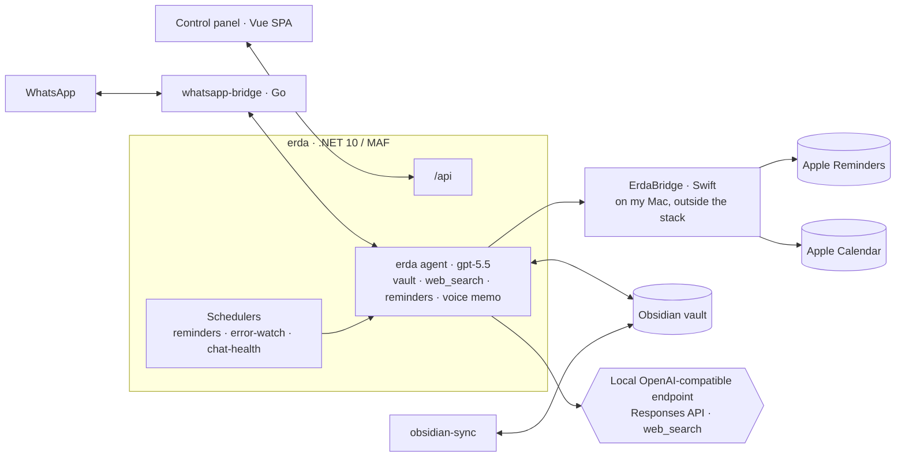

# Erda

A personal AI assistant built on the **Microsoft Agent Framework** (.NET 10). You talk to it
over **WhatsApp** or a small **web control panel**; it lives on a homeserver and works against
an Obsidian vault.

> This is a personal project, built for exactly one user: me. Feel free to read, borrow ideas,
> or run it yourself (`.env.example` documents every setting) — but it's not a product and there
> is no setup support.

## What it does

- **Chat** — over WhatsApp (with a typing indicator) or the panel's chat view.
- **Obsidian vault** — list, read, search, write, and append notes; all paths confined to the vault root.
- **Web grounding** — a native `web_search` tool; Erda is instructed to look things up and cite
  sources instead of answering from model memory.
- **Voice memos** — share an Apple Voice Memo over WhatsApp (or an iOS-Shortcut upload endpoint):
  transcribed, cleaned up by the model, and saved into the vault.
- **Reminders & scheduled prompts** — DB-backed one-shots and recurring prompts that run through
  the agent (so they can use tools). These are *notifications*: at time T, message me.
- **Apple Reminders** (optional) — create, list and complete real tasks in Apple Reminders, via a
  small signed macOS app ([`macos-bridge/`](macos-bridge/)) running on my Mac. Deliberately separate
  from the scheduler above: those are notifications, these are tasks. Lists are addressed by their
  real name; the bridge can reach all of them, and a name that matches nothing (or two lists) is
  refused rather than guessed at.
- **Apple Calendar** (optional) — create an event and read what's coming up, through the same
  bridge. **Reads span every calendar; writes go to exactly one** — the calendar I pick in the
  ErdaBridge app on the Mac. Erda has no calendar parameter on create at all: it doesn't choose
  where an appointment lands, doesn't need to know what my calendars are called, and can't be talked
  into either. With none picked, a create fails with a message telling me to go pick one, rather
  than guessing. Two operations only: **no edit, no delete**, no recurrence, no attendees. This one
  costs a real permission — the bridge holds Calendars *full access*, because write-only can't read
  an event or even enumerate calendars, so it can read every event on that Mac. That trade is
  written down in the bridge's [threat model](macos-bridge/README.md#threat-model); the grant is
  separately deniable and the reminder half keeps working without it.
- **Error watch** — polls a Seq log server, deduplicates errors by signature, has the model
  analyze them, and pings me on WhatsApp.
- **Chat health** — hourly probe of the local OpenAI proxy through the same reasoning path a real
  request takes, so an endpoint that shut down, logged itself out, or answers with nothing gets me a
  WhatsApp message right away instead of surfacing as a silently failed voice memo hours later. One
  alert per outage, one notice when it comes back.

## How it's put together

Three containers: **erda** (the .NET app), a Go **whatsapp-bridge** owning the WhatsApp socket,
and an **obsidian-sync** sidecar keeping the vault synced. The chat model (`gpt-5.5`) is reached
over a local OpenAI-compatible endpoint via the **Responses API** (streamed); an OpenAI platform
key is used only for transcription.

One component lives outside the stack: **ErdaBridge**, a macOS app on my Mac that Erda reaches over
the LAN to touch Apple Reminders and Apple Calendar. It can't be containerised — EventKit only
exists on macOS — so it's the one piece that is off when the Mac is asleep, and the agent is
expected to say so.



Two ways to the model: the **agent** (conversations — system prompt, session, full toolbox) and
**`IReasoner`** (fire-and-forget one-shots: voice-memo formatting, recipe import, error analysis).

## Layout

```
Erda.Core/        # host-agnostic logic: config, EF data, services, schedulers, WhatsApp channel
Erda.Agents/      # the MAF layer: the erda agent, tools, workflows
Erda.Server/      # the runnable app: Program.cs, /api, WhatsApp endpoint, SPA host
Erda.Tests/       # xUnit
web/              # Vue 3 + Vite control panel
whatsapp-bridge/  # Go bridge (whatsmeow)
obsidian-sync/    # headless Obsidian Sync sidecar
macos-bridge/     # ErdaBridge: signed macOS app exposing Apple Reminders + Calendar over the LAN (Swift)
```

## Dev

Configuration is **env-only, no defaults** — copy [`.env.example`](.env.example) to `.env` and
fill it in; missing required values fail at startup naming the key.

```bash
make dev          # backend (:5167) + control-panel SPA (:5173)
make dev-all      # …plus the WhatsApp bridge
dotnet test Erda.Tests/Erda.Tests.csproj
```

Production is a Docker Compose stack with images built by CI ([`build.yml`](.github/workflows/build.yml))
— see [`docker-compose.yml`](docker-compose.yml) if you're curious.
