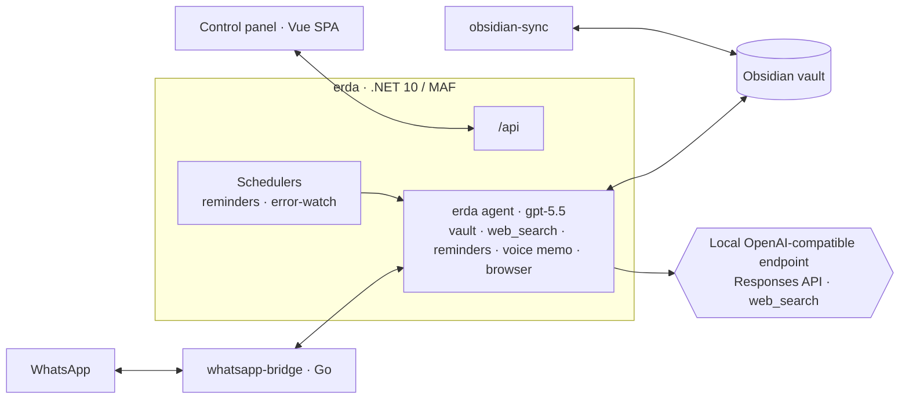

# Erda

A personal AI assistant built on the **Microsoft Agent Framework** (.NET 10). You talk to it
over **WhatsApp** or a small **web control panel**; it lives on a homeserver and works against
an Obsidian vault.

> This is a personal project, built for exactly one user: me. Feel free to read, borrow ideas,
> or run it yourself (`.env.example` documents every setting) — but it's not a product and there
> is no setup support.

## What it does

- **Chat** — over WhatsApp (with a typing indicator) or the panel's chat view.
- **Obsidian vault** — list, read, search, write, and append notes; all paths confined to the vault root.
- **Web grounding** — a native `web_search` tool; Erda is instructed to look things up and cite
  sources instead of answering from model memory.
- **Voice memos** — share an Apple Voice Memo over WhatsApp (or an iOS-Shortcut upload endpoint):
  transcribed, cleaned up by the model, and saved into the vault.
- **Reminders & scheduled prompts** — DB-backed one-shots and recurring prompts that run through
  the agent (so they can use tools).
- **Error watch** — polls a Seq log server, deduplicates errors by signature, has the model
  analyze them, and pings me on WhatsApp.
- **Agentic browsing** (optional) — a Playwright-driven browser with 1Password-backed logins the
  model never sees the credentials for.

## How it's put together

Three containers: **erda** (the .NET app), a Go **whatsapp-bridge** owning the WhatsApp socket,
and an **obsidian-sync** sidecar keeping the vault synced. The chat model (`gpt-5.5`) is reached
over a local OpenAI-compatible endpoint via the **Responses API** (streamed); an OpenAI platform
key is used only for transcription.



Two ways to the model: the **agent** (conversations — system prompt, session, full toolbox) and
**`IReasoner`** (fire-and-forget one-shots: voice-memo formatting, recipe import, error analysis).

## Layout

```
Erda.Core/        # host-agnostic logic: config, EF data, services, schedulers, WhatsApp channel
Erda.Agents/      # the MAF layer: the erda agent, tools, workflows
Erda.Server/      # the runnable app: Program.cs, /api, WhatsApp endpoint, SPA host
Erda.Tests/       # xUnit
web/              # Vue 3 + Vite control panel
whatsapp-bridge/  # Go bridge (whatsmeow)
obsidian-sync/    # headless Obsidian Sync sidecar
```

## Dev

Configuration is **env-only, no defaults** — copy [`.env.example`](.env.example) to `.env` and
fill it in; missing required values fail at startup naming the key.

```bash
make dev          # backend (:5167) + control-panel SPA (:5173)
make dev-all      # …plus the WhatsApp bridge
dotnet test Erda.Tests/Erda.Tests.csproj
```

Production is a Docker Compose stack with images built by CI ([`build.yml`](.github/workflows/build.yml))
— see [`docker-compose.yml`](docker-compose.yml) if you're curious.
